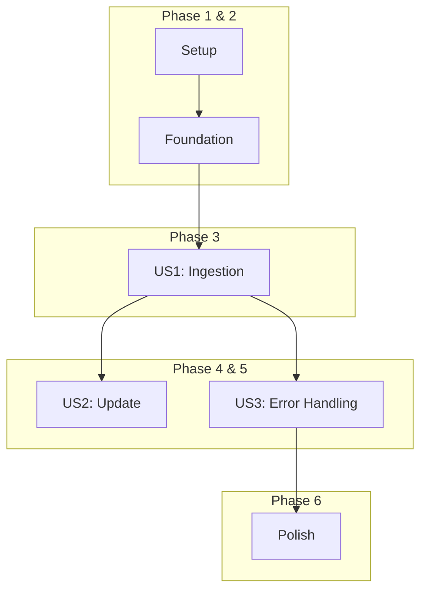

# Tasks: RAG Content Pipeline

**Branch**: `011-rag-content-pipeline` | **Date**: 2025-12-30 | **Plan**: [plan.md](./plan.md)

This document breaks down the implementation plan into actionable, dependency-ordered tasks.

## Phase 1: Project Setup

These tasks initialize the project structure and dependencies.

- [ ] T001 Create the `backend/` directory in the project root.
- [ ] T002 In the `backend/` directory, initialize a `uv` project, which will create a `pyproject.toml` and a `.venv` virtual environment.
- [ ] T003 Add the required Python dependencies (`cohere`, `qdrant-client`, `beautifulsoup4`, `requests`, `python-dotenv`) to `backend/pyproject.toml` using `uv pip install`.
- [ ] T004 Create a `.env.example` file in the `backend/` directory with placeholders for all required environment variables (`TARGET_SITE_URL`, `COHERE_API_KEY`, `QDRANT_URL`, `QDRANT_API_KEY`, `QDRANT_COLLECTION_NAME`).

## Phase 2: Foundational Code

These tasks create the basic file structure and configuration loading.

- [ ] T005 Create the main script file `backend/main.py`.
- [ ] T006 In `backend/main.py`, implement a function `load_config()` to load environment variables from a `.env` file using `python-dotenv`.
- [ ] T007 In `backend/main.py`, define a `VectorRecord` data class or TypedDict that matches the payload schema defined in `data-model.md`.

## Phase 3: User Story 1 - Initial Data Ingestion

**Goal**: A developer can run the pipeline for the first time to populate the vector database.
**Independent Test**: Run `uv run python main.py` and verify that vector records are created in the Qdrant collection specified in the `.env` file.

- [ ] T008 [US1] In `backend/main.py`, implement `get_sitemap_urls(site_url: str) -> list[str]` to fetch and parse the `sitemap.xml` file and return a list of page URLs.
- [ ] T009 [US1] In `backend/main.py`, implement `fetch_and_extract_content(url: str) -> str` to download a page's HTML and extract the text from the `<main>` tag using `BeautifulSoup`.
- [ ] T010 [US1] In `backend/main.py`, implement `chunk_text(text: str) -> list[str]` using a recursive character splitting strategy to break the content into smaller, overlapping chunks.
- [ ] T011 [US1] In `backend/main.py`, implement `get_cohere_embeddings(chunks: list[str]) -> list[list[float]]` to call the Cohere API and get embeddings for a batch of text chunks.
- [ ] T012 [US1] In `backend/main.py`, implement `upsert_to_qdrant(records: list[VectorRecord])` to connect to Qdrant and batch-upsert the vector records.
- [ ] T013 [US1] In `backend/main.py`, create the main orchestration function `run_pipeline()` that calls the other functions in sequence for all URLs, constructs the `VectorRecord` objects, and handles batching for the embedding and upserting steps.
- [ ] T014 [US1] In `backend/main.py`, add the `if __name__ == "__main__":` block to call `run_pipeline()`.

## Phase 4: User Story 2 - Content Update

**Goal**: The vector database can be easily refreshed to reflect content updates.
**Independent Test**: After a successful run, modify a page on the source site, re-run the pipeline, and query Qdrant to confirm the data has been updated.

- [ ] T015 [US2] In `backend/main.py`, ensure the Qdrant collection is recreated on each run by calling `qdrant_client.recreate_collection` before the main processing loop. This provides a simple and effective "refresh" mechanism for this version.

## Phase 5: User Story 3 - Error Handling

**Goal**: The pipeline handles common errors gracefully without crashing.
**Independent Test**: Run the pipeline against a site with a known broken link and confirm the script logs the error but completes the run for other pages.

- [ ] T016 [P] [US3] In `backend/main.py`, refactor the main processing loop in `run_pipeline()` to include `try...except` blocks that catch and log errors for individual page processing (e.g., HTTP 404s), allowing the script to continue with the next URL.
- [ ] T017 [P] [US3] In `backend/main.py`, add `try...except` blocks around external API calls (`get_cohere_embeddings`, `upsert_to_qdrant`) to handle potential API errors or network issues gracefully.

## Phase 6: Polish & Cross-Cutting Concerns

These tasks improve the quality and maintainability of the code.

- [ ] T018 [P] Add type hinting to all function signatures in `backend/main.py`.
- [ ] T019 [P] Add docstrings to all functions in `backend/main.py` explaining their purpose, arguments, and return values.
- [ ] T020 Add `print` statements or basic `logging` throughout `backend/main.py` to provide visibility into the pipeline's progress (e.g., "Crawling sitemap...", "Processing URL: ...", "Upserting batch X to Qdrant...").

## Dependencies

## Implementation Strategy

The implementation will follow the phases outlined above. The primary goal is to deliver **User Story 1** as the Minimum Viable Product (MVP), providing a functional end-to-end pipeline. Subsequent user stories for updates and error handling build upon this foundation.
