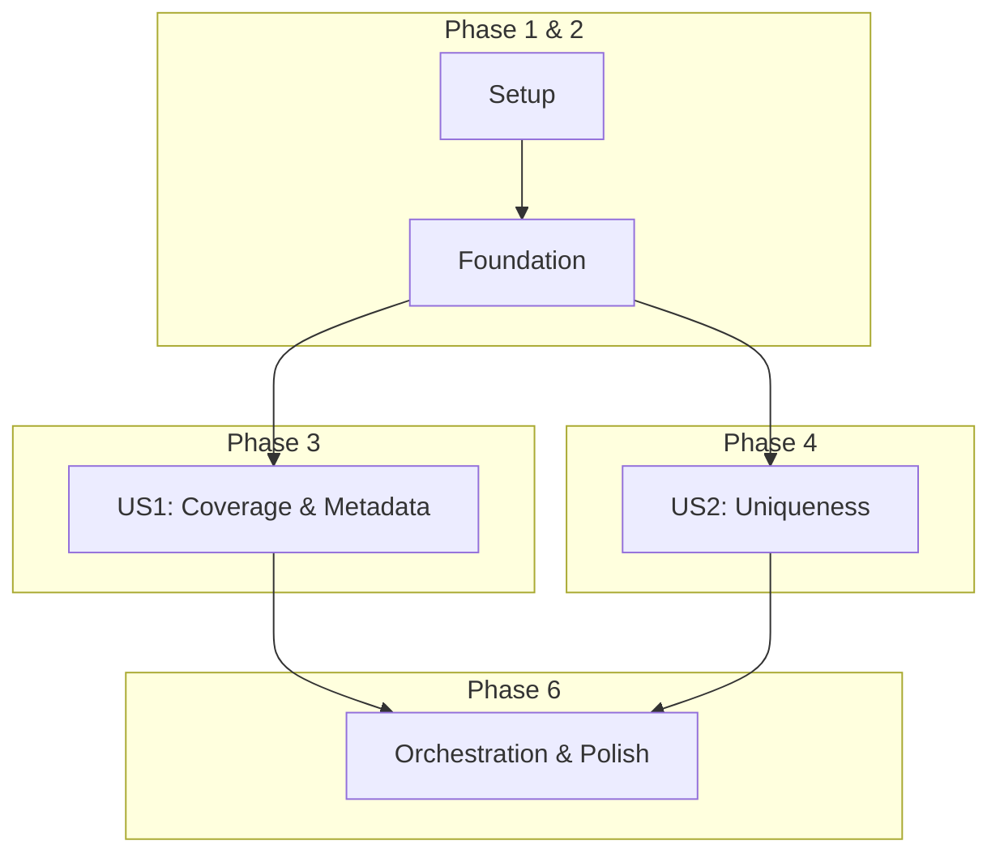

# Tasks: RAG Pipeline Validation Script

**Branch**: `012-test-rag-pipeline` | **Date**: 2025-12-31 | **Plan**: [plan.md](./plan.md)

This document breaks down the implementation plan for the validation script into actionable tasks.

## Phase 1: Project Setup

These tasks initialize the validation script file and its basic structure.

- [x] T001 Create the validation script file `backend/retrieve.py`.
- [x] T002 In `backend/retrieve.py`, add necessary imports: `os`, `logging`, `requests`, `beautifulsoup4`, `qdrant_client`, and `dotenv`.
- [x] T003 In `backend/retrieve.py`, configure basic logging to report the script's progress and findings.

## Phase 2: Foundational Code

These tasks implement the core data loading and retrieval logic.

- [x] T004 In `backend/retrieve.py`, implement a `load_config()` function to load environment variables from the shared `.env` file.
- [x] T005 In `backend/retrieve.py`, implement `get_sitemap_urls(site_url: str) -> list[str]` to fetch and parse the sitemap. This can be copied from `backend/main.py` to keep the script self-contained.
- [x] T006 In `backend/retrieve.py`, implement `get_all_qdrant_records(config: dict) -> list` that uses the `scroll` API to fetch all points with their payloads from the Qdrant collection.

## Phase 3: User Story 1 - Verify Page Coverage and Metadata

**Goal**: Confirm the ingestion pipeline processed all pages and metadata is correct.
**Independent Test**: Run the validation script and check the log output for page coverage percentage and metadata validation status.

- [x] T007 [US1] In `backend/retrieve.py`, implement `validate_page_coverage(sitemap_urls: list, qdrant_records: list) -> bool` to compare sitemap URLs with URLs in Qdrant records, log the coverage percentage, and list any missing URLs.
- [x] T008 [US1] In `backend/retrieve.py`, implement `validate_metadata(qdrant_records: list) -> bool` to sample records and check for the presence and valid format of `url`, `section_title`, `chunk_index`, and `processed_at` in the payload. It should also validate that the vector has the expected dimension (1024).

## Phase 4: User Story 2 - Validate Uniqueness

**Goal**: Ensure no duplicate content exists in the collection.
**Independent Test**: Run the validation script and check the log output for a summary of duplicate findings.

- [x] T009 [US2] In `backend/retrieve.py`, implement `validate_uniqueness(qdrant_records: list) -> bool` to check for duplicate records by creating a set of unique identifiers (e.g., tuple of `(url, chunk_index)`) from the payloads and logging any duplicates found.

## Phase 5: User Story 3 - Confirm Idempotent Pipeline Rerun

**Goal**: Verify re-running the ingestion pipeline does not corrupt data.
**Note**: No new implementation tasks are required for this user story. The functionality developed in `validate_uniqueness` (T009) is the primary mechanism for verifying this. The test is procedural: run the ingestion pipeline, run the validation script, re-run the ingestion pipeline, and run the validation script again to compare results.

## Phase 6: Polish & Orchestration

These tasks bring all the validation checks together into a runnable script.

- [x] T010 In `backend/retrieve.py`, create the `main()` orchestration function that calls `load_config`, `get_sitemap_urls`, `get_all_qdrant_records`, and all the validation functions.
- [x] T011 In `backend/retrieve.py`, enhance `main()` to print a clear, final summary report to the console, indicating which validation checks passed or failed.
- [x] T012 In `backend/retrieve.py`, add the `if __name__ == "__main__":` block to call `main()`.
- [x] T013 [P] Add type hinting to all new function signatures in `backend/retrieve.py`.
- [ ] T014 [P] Add docstrings to all new functions in `backend/retrieve.py`.

## Dependencies

## Implementation Strategy

The implementation will focus on building the validation functions first, then orchestrating them in the `main()` function. The script is designed to be a self-contained tool for ensuring the reliability of the RAG pipeline's data source. The MVP is a script that can perform the checks for User Story 1 (coverage and metadata).
